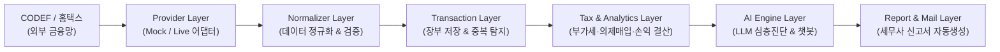
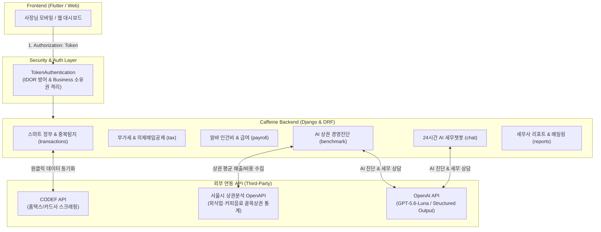

# ☕ 카페비서 (Caffeine Backend)

> **소상공인 카페 사장님을 위한 AI 세무·경영 컨설팅 & 스마트 장부 자동화 솔루션**  
> 2026 동국대학교 멋쟁이사자처럼 해커톤 Team 5 (Caffeine)

[](https://python.org)
[](https://djangoproject.com)
[](https://www.django-rest-framework.org/)
[](https://openai.com)
[]()
[](https://backendkingjinho.shop/api/schema/swagger-ui/)
[](https://backendkingjinho.shop)

---

## 📌 서비스 소개

동네 소형 카페 사장님들은 매일 에스프레소를 내리고 손님을 맞이하느라 **복잡한 세무 정리(부가세, 의제매입세액, 인건비)**와 **경영 원가 관리(식자재율, 임대료, 상권 분석)**에 시간을 쏟기 어렵습니다.

**카페비서**는:
1. **원클릭 동기화**로 홈택스/카드사 매출·매입 데이터를 실시간 수집하고,
2. 카페 특화 **우유·원두 의제매입세액 공제 자동화**로 부가세 폭탄을 방어하며,
3. **서울시 상권분석 OpenAPI**와 결합해 내 매장의 건강도(86점 등)와 **3대 맞춤 경영 처방**을 제공하고,
4. **24시간 AI 세무 챗봇**과 **세무사 원클릭 신고 리포트 전송**까지 지원하는 올인원 AI 비서입니다.

---

## 🏛️ 데이터 파이프라인 & 시스템 아키텍처

### 🔄 End-to-End 데이터 파이프라인


### 🏗️ 전체 시스템 구조도


---

## 🤖 AI 역할 및 아키텍처 정의

카페비서는 **2-Tier 하이브리드 엔진**을 통해 정확성과 지능을 동시에 확보합니다:
- **1차 (Deterministic Engine)**: 금융 거래 정규화, 의제매입세액 세법 산출, 주휴수당/4대보험 계산 등 100%의 정확성이 요구되는 영역은 정밀 Rule-based 엔진으로 즉시 처리
- **2차 (Generative AI Engine - GPT-5.6-Luna)**: 복합 세무 장부 데이터 해석, 상권 벤치마크 기반 3대 맞춤 경영 처방(Structured Output), 24시간 상황별 세무 상담 챗봇 등 고차원적 의사결정 지원에 LLM 활용

---

## 🔒 보안 및 소유권 격리 (IDOR Protection)

- **DRF TokenAuthentication**: 헤더 기반 RESTful 토큰 인증 체계 (`Authorization: Token <key>`)
- **Business Ownership Guard**: 사업장에 접근하는 모든 API 엔드포인트에서 현재 로그인된 유저의 사업장 소유권(`owner=request.user`)을 검증하여 타 유저의 사업장 데이터 무단 열람/변조를 원천 차단 (`403 Forbidden` 방어, `core/permissions.py`에 단일화)
- **개인정보 보호**: 근로자 주민등록번호 및 계좌정보 AES-256 Fernet 양방향 암호화 저장
- **데모 게스트 인증 (의도된 설계)**: 부스 시연 편의를 위해 무인증 요청을 데모 계정으로 인증하되(`DEMO_MODE`), 해당 요청은 `is_demo=True`로 시딩된 사업장에만 접근 가능하도록 권한 계층에서 강제합니다(`core/authentication.py`, `core/permissions.py`). 실 사용자 사업장은 `is_demo=False`이므로 게스트 토큰으로는 도달할 수 없습니다. 실서비스 전환 시 `.env`에 `DEMO_MODE=0`을 설정하세요.

---

## 📖 API 문서 (Swagger / OpenAPI)

- **Swagger UI**: `/api/schema/swagger-ui/`
- **ReDoc**: `/api/schema/redoc/`
- **OpenAPI Schema**: `/api/schema/`

---

## ✨ 핵심 기능

### 1. 📱 금융 & 국세청 데이터 자동 연동 (`businesses`, `transactions`)
- **카카오 2-Way 간편인증**을 통한 국세청 홈택스 및 사업용 카드사 연동
- 현금영수증 매출, 전자세금계산서 매입/매출, 사업용 신용카드 매입, 카드사 월별 매출 집계 자동 동기화
- **중복 거래 의심 자동 탐지 & 병합**

### 2. 💰 카페 특화 부가세 예측 & 의제매입세액 공제 (`tax`)
- **우유/생과일 등 면세 식자재 자동 식별** 및 의제매입세액 공제액 자동 산출
- 사장님이 놓친 면세 계산서 누락 알림 및 매입세액 공제/불공제 검토 워크플로우
- 실시간 예상 부가세 납부세액 계산

### 3. 🏆 AI 상권 벤치마크 & 맞춤 경영 진단 (`benchmark`)
- **서울시 상권분석 OpenAPI(커피-음료 `CS100010`)** 실시간 통계 결합
- 내 매장 원가율(식자재 36.5%, 인건비 23.3%, 임대료 10.0%, 소모품 6.2%) vs 골목상권 평균 비교
- OpenAI 구조화 진단 엔진: **종합 건강도 점수(86점 도넛), 사장님 3대 원포인트 처방, 3대 요약** 제공

### 4. 👥 알바생 인건비 & 급여 관리 (`payroll`)
- 시급제/주휴수당 자동 계산 및 주민등록번호 AES-256 암호화 저장
- 급여명세서 조회 및 급여대장 엑셀 다운로드

### 5. 💬 24시간 AI 세무 챗봇 & 세무사 신고 전송 (`chat`, `reports`)
- 내 매장 장부 기반 맞춤형 실시간 세무 질의응답 (GPT-5.6-Luna)
- 세무 신고용 월별 장부 PDF/Excel 자동 생성 및 **담당 세무사 이메일 원클릭 발송**

---

## 🌐 라이브 배포 환경

- **Production Server**: `https://backendkingjinho.shop`
- **Swagger Documentation**: `https://backendkingjinho.shop/api/schema/swagger-ui/`
- **인프라 구성**: Gabia Ubuntu 22.04 LTS + Nginx + Gunicorn (Systemd Service) + Let's Encrypt SSL (HTTPS)

---

## 🛠️ 로컬 개발 환경 실행

```bash
# 1. 레포지토리 클론
git clone https://github.com/LikeLion-at-DGU/2026-Hackathon-team5-Caffeine-BE.git
cd 2026-Hackathon-team5-Caffeine-BE

# 2. 가상환경 생성 및 활성화
python -m venv venv
source venv/bin/activate  # Windows: venv\Scripts\activate

# 3. 의존성 패키지 설치
pip install -r requirements.txt

# 4. 데이터베이스 마이그레이션 & 시드 데이터 적재
python manage.py migrate
python manage.py seed_demo_data --reset
python manage.py seed_benchmark_data --fetch-live

# 5. 로컬 개발 서버 실행
python manage.py runserver
```

---

## 🧪 테스트 실행

```bash
# 전체 359개 단위/통합/보안 테스트 및 시스템 점검 실행
python manage.py test
python manage.py check
```

---

## 👥 Caffeine Backend Team

- **LikeLion at Dongguk Univ. (2026 Hackathon Team 5)**
- Copyright © 2026 Caffeine. All rights reserved.
